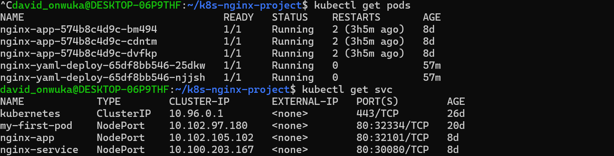
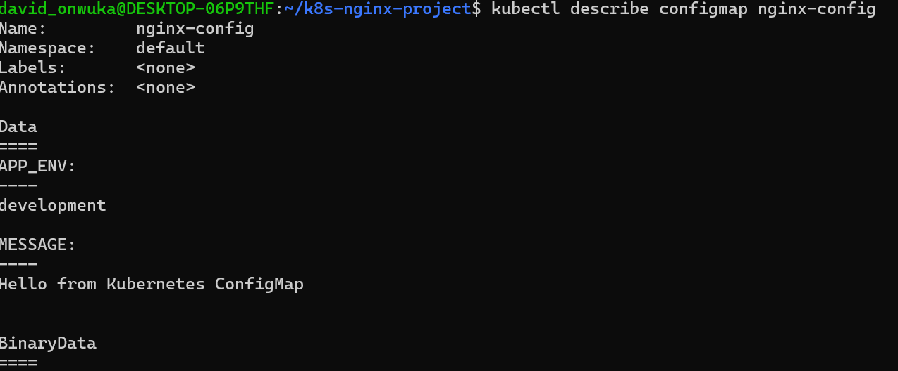
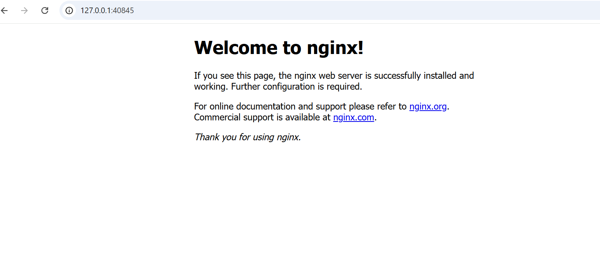

# Kubernetes-Based Deployment of a Containerized Nginx Web Application (Minikube)

---

##  Project Overview

This project demonstrates a complete end-to-end Kubernetes deployment workflow using Minikube. A containerized Nginx web application was deployed using Kubernetes core objects including Deployments, Services, ConfigMaps, and Ingress.

The goal of this project is to simulate a real-world cloud-native application deployment pipeline, showcasing DevOps skills in container orchestration, infrastructure configuration, service exposure, and debugging Kubernetes resources.

This project was built as part of my hands-on DevOps learning journey.

---

##  Project Goals

- Deploy a containerized Nginx application on Kubernetes
- Understand Kubernetes object lifecycle and orchestration
- Expose applications using Service (NodePort)
- Manage configurations using ConfigMaps
- Implement Ingress for controlled routing
- Validate scaling and self-healing capabilities of Kubernetes
- Strengthen Linux + kubectl operational skills

---

##  Technologies Used

- Kubernetes (K8s)
- Minikube (Local cluster)
- Kubectl CLI
- Docker (underlying container runtime)
- YAML (Infrastructure as Code)
- Linux (Ubuntu / WSL environment)
- Git & GitHub (Version control)

---

##  Architecture Overview

User (Browser)
↓
Ingress Controller (optional routing layer)
↓
NodePort Service (exposes app externally)
↓
Kubernetes Pods (Nginx containers)
↓
ConfigMap (application configuration layer)

Flow Explanation:
1. User accesses the application via browser
2. Request is routed through NodePort Service
3. Service distributes traffic to available Pods
4. Pods run the Nginx container
5. ConfigMap injects environment configuration into Pods

---

## Project Structure

manifests/
├── nginx-deployment.yaml
├── nginx-service.yaml
├── nginx-configmap.yaml
├── nginx-ingress.yaml

screenshots/
├── pods-service1.png.png
├── configmap.png.png
├── browser.png.png

---

## Kubernetes Manifests Breakdown

Deployment:
- Manages replica sets of Nginx Pods
- Ensures self-healing and auto-replacement of failed Pods

Service (NodePort):
- Exposes application outside the cluster
- Maps internal Pod port to external node port

ConfigMap:
- Stores environment variables separately from application code
- Enables configuration without rebuilding containers

Ingress:
- Provides routing rules for external HTTP traffic
- Enables cleaner URL access

---

## Screenshots

Pods and Service Running:

Shows all Pods in Running state and confirms service exposure via NodePort.

---

ConfigMap Applied:

Shows environment variables injected using Kubernetes ConfigMap.

---

Browser Output:

Confirms the Nginx application is accessible via browser through Kubernetes Service.

---

## Deployment Steps

kubectl apply -f manifests/
kubectl get pods -o wide
kubectl get svc
kubectl get ingress
kubectl describe pod <pod-name>

---

##  Challenges Faced & Solutions

1. File Mixing Issue
- Old project files were mixed with Kubernetes files
- Fixed by separating into a clean project directory

2. GitHub Repository Confusion
- Initial push included unwanted files
- Fixed by restructuring project before final push

3. Screenshot Path Issues
- Images not properly tracked
- Fixed using dedicated screenshots folder

4. Kubernetes Debugging
- Pods and services required troubleshooting
- Used kubectl describe and logs for debugging

---

##  Key Learnings

- Kubernetes architecture and object relationships
- Deployment and scaling strategies
- Service exposure methods (NodePort vs ClusterIP)
- Configuration management using ConfigMaps
- Debugging distributed systems using kubectl
- Importance of clean project structure
- GitHub version control workflow

---

## Real-World DevOps Relevance

- Microservices deployment
- Container orchestration
- Infrastructure as Code (IaC)
- Service discovery and routing
- Configuration separation from code
- Scalable cloud-native architecture

---

##  Author

David Onwuka

---

##  Project Status

Successfully deployed on Minikube  
Fully functional Kubernetes application  
Tested and validated using kubectl  
Ready for portfolio demonstration
